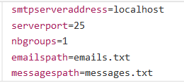
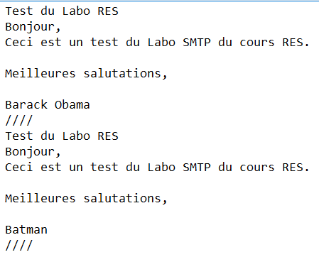
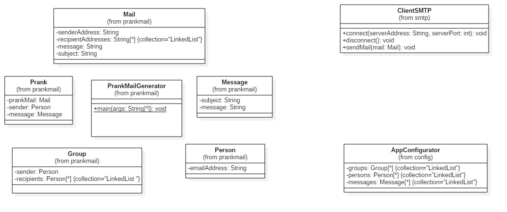
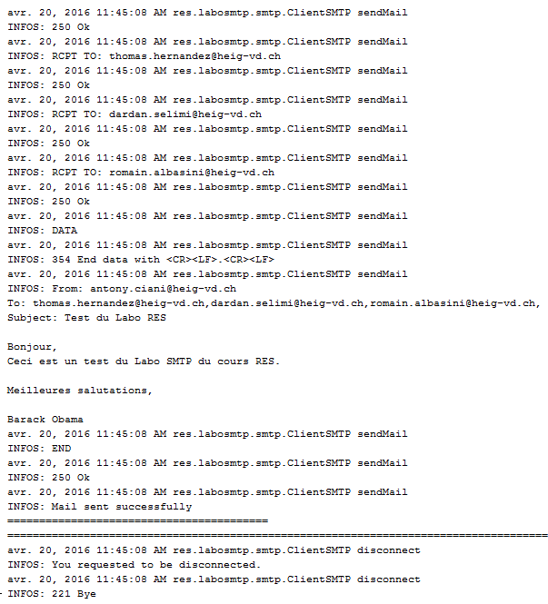

# Teaching-HEIGVD-RES-2016-Labo-SMTP

## CIANI Antony, HERNANDEZ Thomas

## Description

This project is an implementation of a client application (TCP) in Java that automatically plays pranks on a list of victims. The goal is to make random groups of a list of email addresses that are passed to the application and to select a random message and send it to the groups via email. A partial implementation of the SMTP protocol is used to communicate with a SMTP server through Sockets to send the prank emails generated by our application.

Basically, you can edit the emails.txt file with your own mailing list, which will define the list of victims. You can also edit the messages.txt file with your own messages. When a prank is played, one of this message is selected to be the data of your mail. You can set the properties of the applicatoin to define how many groups of victims should be formed and which server should be used to send the emails. N.B : For each group, there is 1 sender and at least 2 recipients hence at least 3 emails per group you want to form.

## Example

Here is a simple exemple: consider that the program generates a group G from a list of 4 victims. The group sender is Bob and the recipients are Alice, Mallory and Jean-Kevin. When the prank is played on group G, then one of the fake messages is picked. The program communicates with a SMTP server so that Alice, Mallory and Jean-Kevin receive a mail, which appears to be sent by Bob.

## Installation

- **Easy**

1. Download the content of the release folder
2. Proceed to Configuration step by modifying the provided files (see below)
3. Run MockMock (optional, see below)
4. Open a terminal and run the JAR file (`java -jar LaboSMTP-1.0-SNAPSHOT-launcher.jar`)
5. Enjoy!

- **Pro**

1. Clone this repo on your computer
2. Open the Maven project contained in the LaboSMTP folder
3. Proceed to Configuration step (see below)
4. Run the project (this will also generate a JAR file)
5. Enjoy!

## Configuration

In order to run a prank campaign, you need to configure the following files:

- **appconfig.properties**

	this file contains the following fields:

	

	*smtpserveraddress*: the address of the SMTP server you want to use
	
	*serverport*: the port's number you want to connect to, in order to reach the SMTP server.

	*nbgroups*: the number of group you want

	*emailspath*: the file that contains your victims' mails.

	*messagespath*: the file that contains the text of the mails.

- **emails.txt**

	this file contains the e-mail addresses of your victims. You just need to write your own addresses. The only condition is to write one address per line.

- **messages.txt**

	this files contains the messages you will send to your victims. You write your own messages but the file must have this format:

	

	where the first line is the subject and each message must be seperated with ////

## Implementation

Here below you can see the class diagram of our implementation:

Three distincts group are showed on this diagram, depending on the classes' job. On the left, all the classes around our main class (PrankMailGenerator) are dedicated to the generation of the prank mails. On the top right, the ClientSMTP class manages the connexion to a SMTP server with the help of our SMTP protocol. The class that contains our protocol is not visible on the diagram because it only contains static Strings which represent the behavior of our protocol. On the bottom right, the AppConfigurator is the tool that can extract all the informations needed in order to generate a prank.

Moreover, the next few classes need a special focus regarding their responsibilities in our implementation:

- *AppConfigurator*: it retrieves the messages and the emails from the corresponding files and also creates a certain number of groups. Thus, it generates the informations needed for a prank.

- *PrankMailGenerator*: the main program who first reads the configuration file and do the setup. Then, it forms random groups depending on the properties and if the number of emails addresses is not enough (less than 3) it stops and warns the user. Finally, a prank is generated with a random message and sent with our SMTP client.

- *ClientSMTP*: allows a connection to a SMTP server in order to send emails. Once connected, our SMTP protocol "like" is used to perform the job and verify its good behavior.

- *Prank*: Generates a prank email. It takes a group, select a random message from a list and build the resulting Mail object.

- *Mail*: Represents all the information needed to send an email. The sender address, the various recipients addresses, the subject of the message and the message itself.

Here below you can see an exemple of dialogue between our client and a SMTP server:

  

## Installing and using a mock SMTP server

If you want to experiment with our tool, without "really" sending mails immediately, you can first try it with a mock SMTP server. It means that you will be connected to this server, which run on your machine, instead of a "real" one. Thus, your victims won't receive your emails, but you will be able to read them and check if everything is ready for your prank.

**Installing MockMock**

1. Click on this link: [https://github.com/tweakers-dev/MockMock](https://github.com/tweakers-dev/MockMock/release)
2. Download the MockMock.jar file
3. Run the JAR file using this command by opening a terminal in the directory where it is stored. `java -jar MockMock.jar `
3. This launches a STMP server on port 25 and an HTTP server on port 8282
4. Open a browser and go to [http://localhost:8282] (http://localhost:8282) to see if you have any new mails!

## Disclaimer

This application has been developed for educational purposes only. The authors disclaim any responsibility from the damage it may cause by using it with servers you are not allowed to use and by causing collateral damages such as losing all your friends because they don't have enough sense of humor or because your pranks where really bad.
